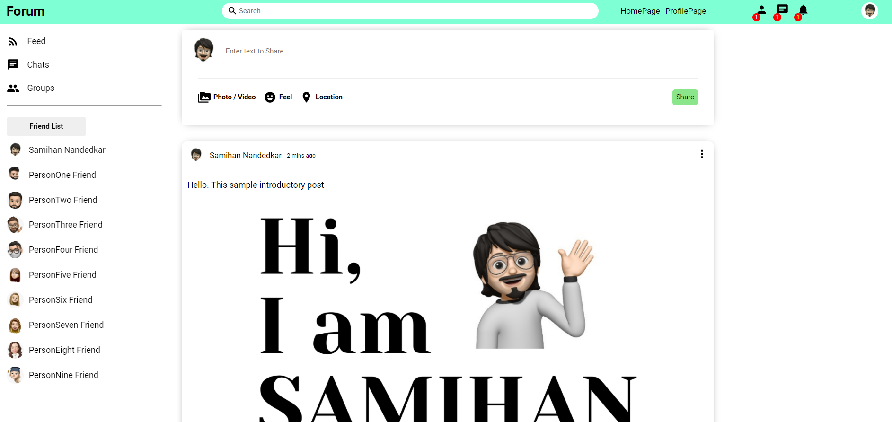
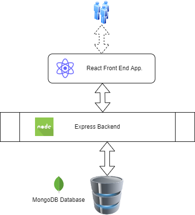
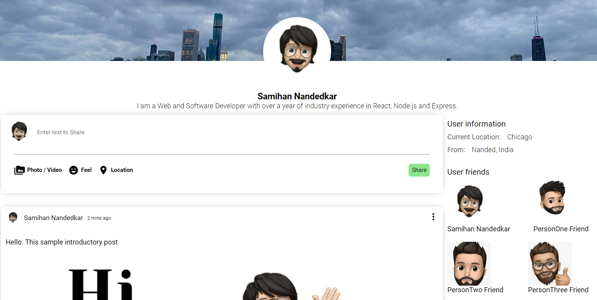

<div id="top"></div>

<!-- PROJECT LOGO -->
<br />
<div align="center">
  <a>
    
  </a>

  <h3 align="center">Forum</h3>

  <p align="center">
    A social media application created using MERN tech stack
    <br />
    <a href="#"><strong>Explore the docs »</strong></a>
    <br />
    <br />
    ·
    <a href="https://samihann.github.io/forum-ui-demo/">View Demo</a>
    ·
    
    A sample demo for UI is deployed on Github pages. It can be accessed using the link given above.

    Please Note: All features are not available as backend in not currently online. 
  </p>
</div>


<!-- TABLE OF CONTENTS -->
<details>
  <summary>Table of Contents</summary>
  <ol>
    <li>
      <a href="#about-the-project">About The Project</a>
      <ul>
        <li><a href="#built-with">Built With</a></li>
      </ul>
    </li>
    <li>
      <a href="#deployment">Deployment</a>
    </li>
    <li>
      <a href="#getting-started">Getting Started</a>
      <ul>
        <li><a href="#prerequisites">Prerequisites</a></li>
        <li><a href="#installation">Installation</a></li>
      </ul>
    </li>
    <li><a href="#contact">Contact</a></li>
    <li><a href="#acknowledgments">Acknowledgments</a></li>
  </ol>
</details>


<!-- ABOUT THE PROJECT -->
## About The Project



The project is a full stack application with React frontend, Express backend and MongoDb database.

In the application, user is able to perform following tasks:
* Create a profile.
* Follow and unfollow other users.
* Share post with multimedia with all followers.
* Like/Unlike the posts of other users. 
* Comment on posts of other users.

Please refer below to view the project structure. 


<p align="right">(<a href="#top">back to top</a>)</p>

## Profile Page




### Built With

Major frameworks/libraries used to create the project. 

* [React.js](https://reactjs.org/)
* [Express.js](https://expressjs.com/)
* [Node.js](https://nodejs.org/en/)
* [Axios](https://axios-http.com/docs/intro)
* [MongoDB](https://www.mongodb.com/)
* [Material-UI](https://mui.com/)


<p align="right">(<a href="#top">back to top</a>)</p>

## Deployment

A sample UI demo is deployed on Github pages. It can be viewed by clicking the link given at the begining of the application.

<!-- GETTING STARTED -->
## Getting Started

Please follow the given instructures to setup the application locally on your system.

### Prerequisites

Please install the given software using the steps given below. 
1. Node: Dowload the appropriate installation package from the given [link](https://nodejs.org/en/download/)

### Installation

1. Clone the repo
   ```sh
   git clone 
   ```
2. Navigate to api directory
3. Install all the NPM packages required for the directory
   ```sh
   npm install
   ```
4. Start the backend Express server by running the following command.
   ```sh
   npm start
   ```
7. Navigate to frontend-client directory
8. Install all the NPM packages required for the directory

   ```sh
   npm install
   ```
8. Start the frontend React server by running the following command.

   ```sh
   npm start
   ```

Note: Please add the MongoDB credentials in .env file in api directory.

The application should be accessible at http://localhost:3000/

<p align="right">(<a href="#top">back to top</a>)</p>

<!-- CONTACT -->
## Contact

Samihan Nandedkar - svn2998@example.com

Email: svn2998@gmail.com

<p align="right">(<a href="#top">back to top</a>)</p>


<!-- ACKNOWLEDGMENTS -->
## Acknowledgments

Thesse resources were useful in the building of application. 

* [Axios Request](https://masteringjs.io/tutorials/axios/basic_auth)
* [Create React Application](https://reactjs.org/docs/create-a-new-react-app.html)
* [Express Generator](https://expressjs.com/en/starter/generator.html)
* [Environment Variables](https://stackoverflow.com/questions/48605484/environment-variables-env-in-node-js-express?rq=1)
* [GitHub Pages](https://pages.github.com)
* [Font Awesome](https://fontawesome.com)
* [React Icons](https://react-icons.github.io/react-icons/search)

<p align="right">(<a href="#top">back to top</a>)</p>


